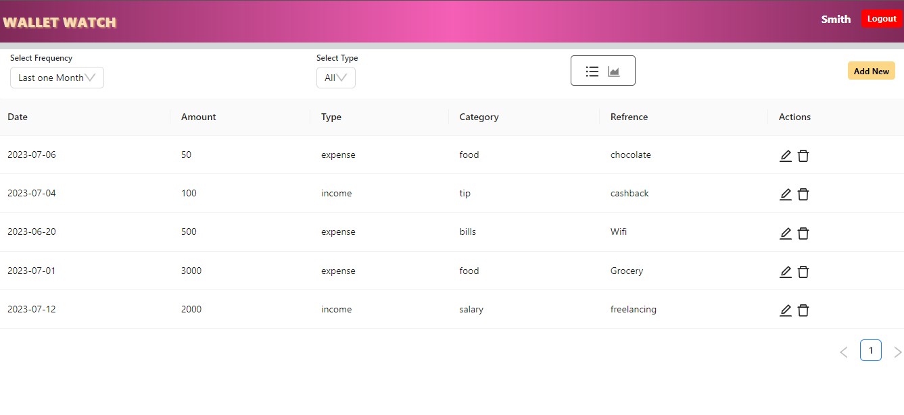
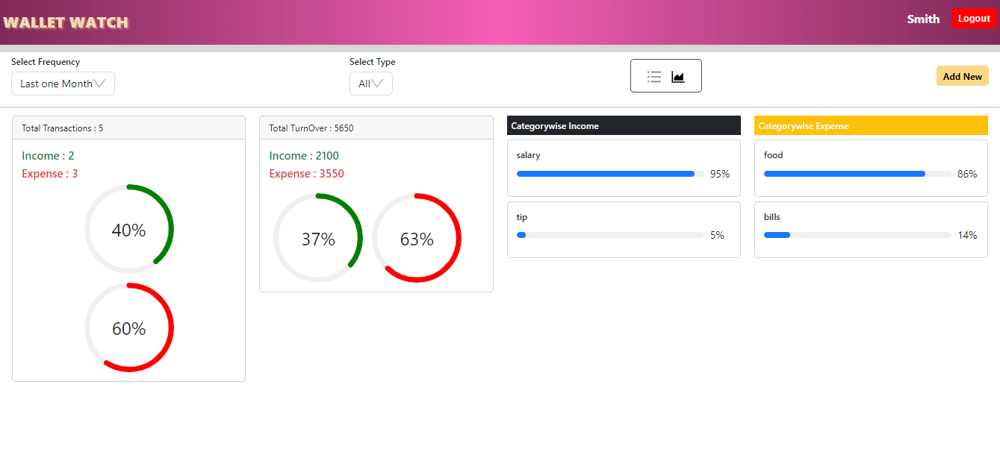

# Wallet Watch

WalletWatch is an expense management system that allows users to track and analyze their 
income and expenses, helping them keep accurate records and gain insights into their financial 
habits
### Live App 
https://elated-cyan-chimpanzee.cyclic.app/ 

## User Experience Showcase

## Features

- **User Registration and Authentication:** Create a secure account and log in to access your personalized financial dashboard.
- **Expense and Income Tracking:** Record your expenses and income with detailed information such as date, category, description, and amount.
- **Entry Management:** Add, delete, and modify entries to keep your financial records accurate and up to date.
- **Categorization:** Classify your transactions into categories to easily understand and analyze your spending and income patterns.
- **Data Visualization:** Visualize your expenses and income through informative pie charts, allowing for easy comparison and identification of trends.

## Installation

- Clone the repository: git clone https://github.com/DishuVerma/WalletWatch.git
- Install the necessary dependencies: npm install
- Configure the database connection in the .env file.
- Start the application: npm start
## Tech Stack

- HTML, CSS, and JavaScript for the front-end development
- React.js for building the user interface
- Node.js and Express.js for the back-end development
- MongoDB for the database management
- Material UI for design and styling                                                                     
